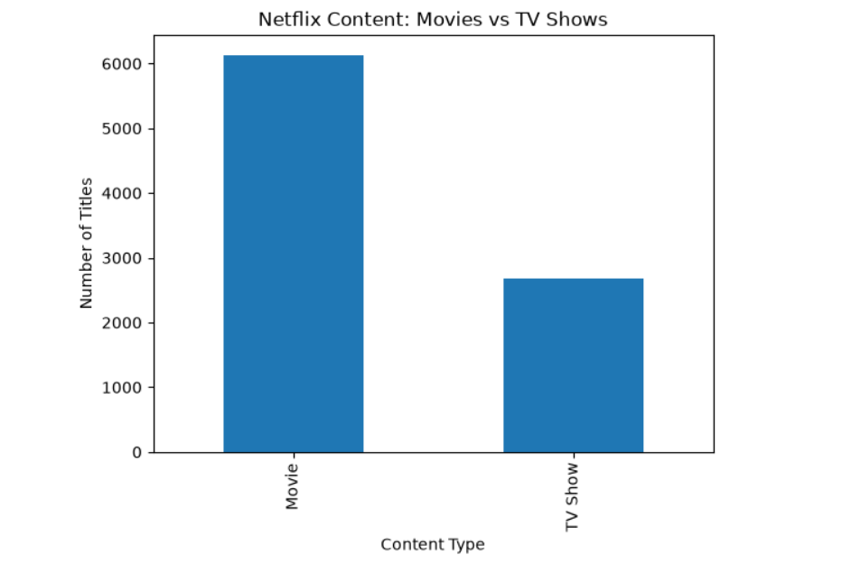
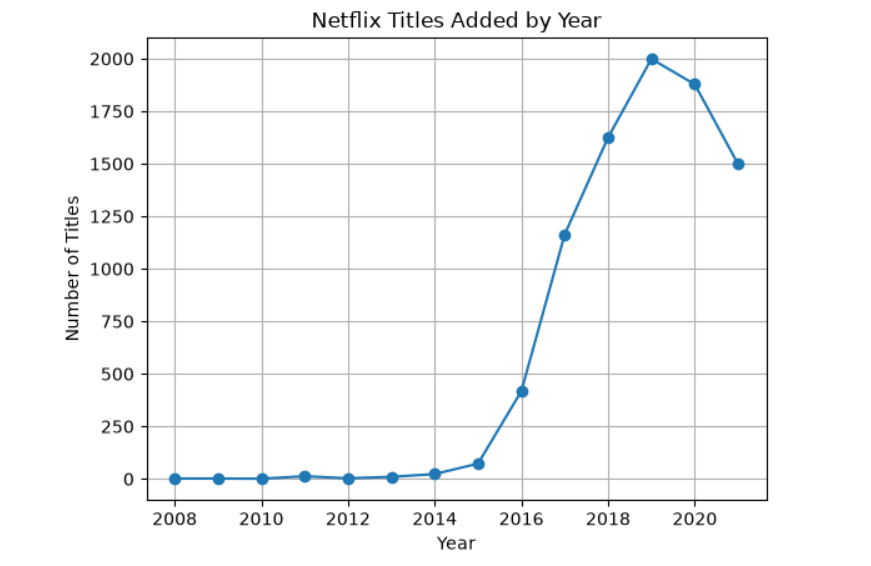
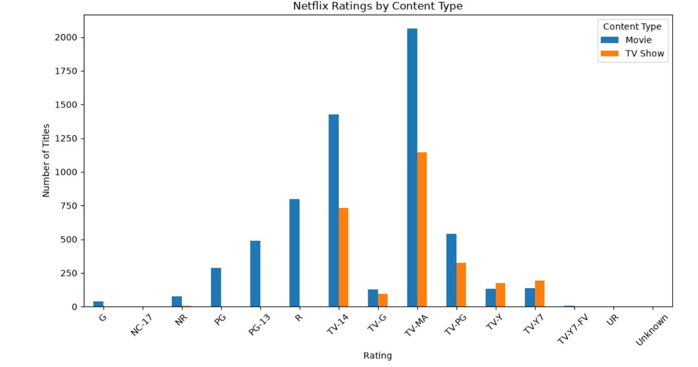
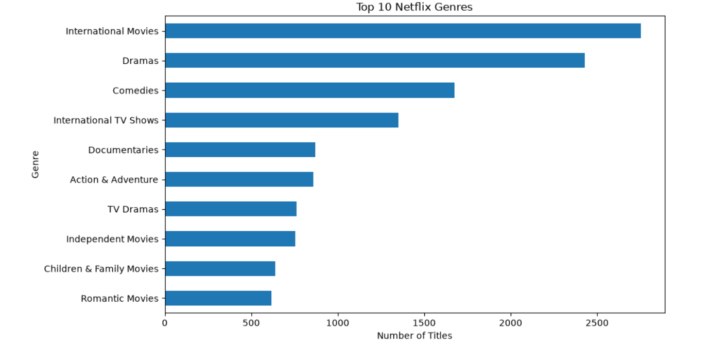
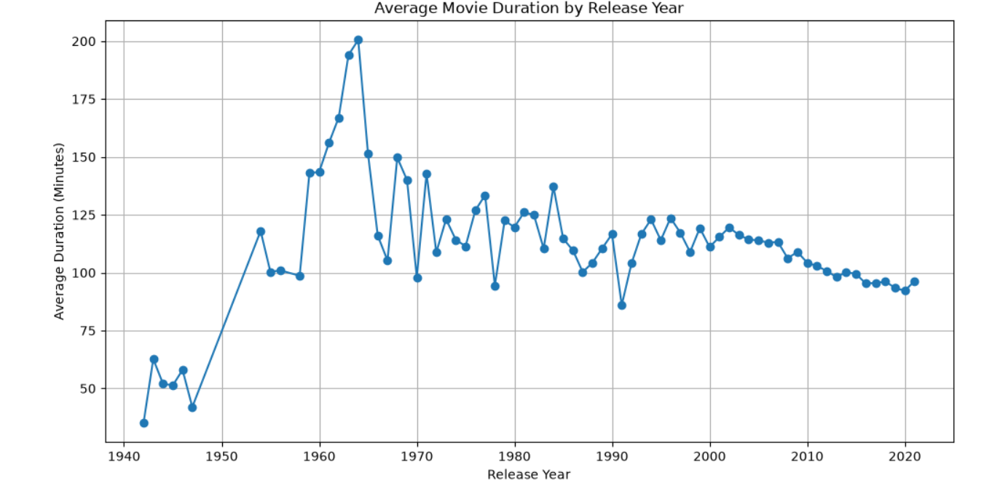
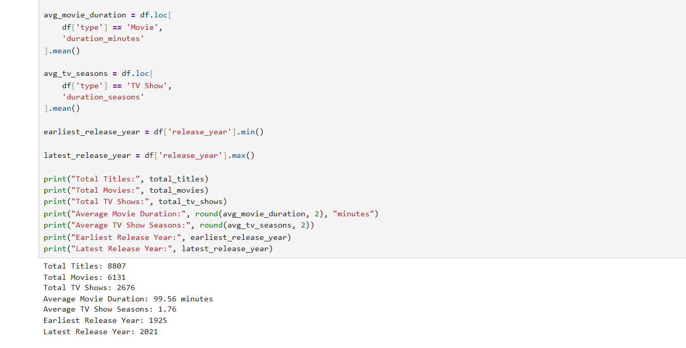

# Netflix Movies & TV Shows — Data Analysis

## 📌 Project Overview

This project performs an exploratory data analysis of the Netflix Movies and TV Shows dataset using Python.

The analysis explores Netflix's content library based on content type, countries, ratings, genres, release years, duration, directors, and actors.

The goal of this project is to identify patterns and trends in the dataset and transform raw data into meaningful insights.

---

## 🎯 Objectives

- Analyze the distribution of Movies and TV Shows
- Examine Netflix titles added over time
- Identify countries with the highest representation
- Analyze content ratings
- Explore movie durations and TV show seasons
- Identify the most common genres
- Analyze directors and actors
- Compare Movies and TV Shows across countries and genres
- Summarize important findings using statistical metrics

---

## 🛠️ Tools & Technologies

- **Python**
- **Pandas**
- **Matplotlib**
- **Jupyter Notebook**

---

## 📂 Dataset

The analysis uses the **Netflix Movies and TV Shows** dataset, containing information about Netflix titles such as:

- Show ID
- Type
- Title
- Director
- Cast
- Country
- Date Added
- Release Year
- Rating
- Duration
- Listed In
- Description

The dataset contains **8,807 titles**.

---

## 🔍 Analysis Performed

### 1. Movies vs TV Shows
Analyzed the distribution of Movies and TV Shows in the dataset.

### 2. Titles Added Over Time
Examined the number of titles added by year and compared Movies with TV Shows.

### 3. Country Analysis
Identified the countries with the highest representation in the dataset.

### 4. Ratings Analysis
Analyzed the distribution of content ratings across Netflix titles.

### 5. Duration Analysis
Explored movie durations and the number of seasons of TV Shows.

### 6. Genre Analysis
Identified the most frequently represented genres.

### 7. Director & Actor Analysis
Examined directors and actors with the highest number of titles.

### 8. Release Year Analysis
Analyzed the distribution of titles based on their original release year.

### 9. Country & Content Type Analysis
Compared Movies and TV Shows across different countries.

### 10. Genre & Content Type Analysis
Compared the most common genres for Movies and TV Shows.

---

## 📊 Key Findings

- The dataset contains **8,807 titles**.
- There are **6,131 Movies** and **2,676 TV Shows**.
- Movies account for **69.62%** of the dataset, while TV Shows account for **30.38%**.
- **2019** was the peak year for titles added, with **1,999 titles**.
- The **United States** is the most represented country, with **3,689 titles**.
- Titles associated with the United States account for approximately **41.89%** of the dataset.
- The average movie duration is **99.56 minutes**, with a median of **98 minutes**.
- TV Shows have an average of **1.76 seasons**, with a median of **1 season**.
- **International Movies** is the most frequently represented genre, with **2,752 titles**.
- **TV-MA** is the most common rating, with **3,207 titles**.

---

## 📁 Project Structure

```text
netflix-data-analysis/
│
├── README.md
├── netflix_analysis.ipynb
├── duration_analysis.png.png
├── movies_vs_tv_shows.png.png
├── rating_analysis.png.png
├── summary_kpi.png.png
├── titles_added_over)time.png.png
├── top_countries.png.png
└── top_genres.png.png
```

## 📊 Project Visualizations

### Movies vs TV Shows



### Titles Added Over Time

time.png.png)

### Top 10 Countries



### Ratings Analysis



### Top 10 Genres



### Duration Analysis



### Summary KPIs



